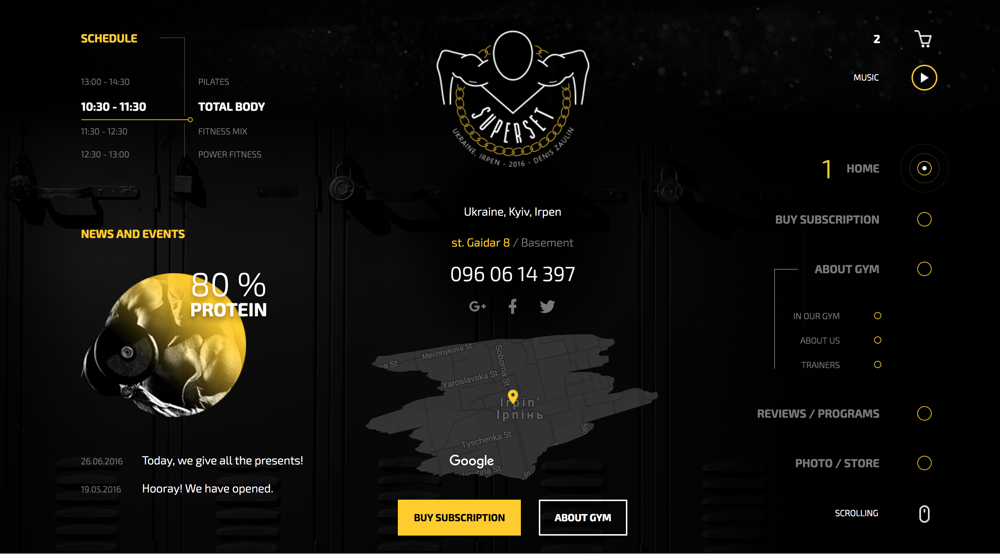

## Running
For running and deploying application you need go through following steps

- Get started with installing dependencies:

      cd src

      # Make sure you have yarn as a package manager globaly installed
      npm install -g yarn forever && yarn

      # Now once the dependencies are resolved start server
      forever start app.js

## Screenshots
 
