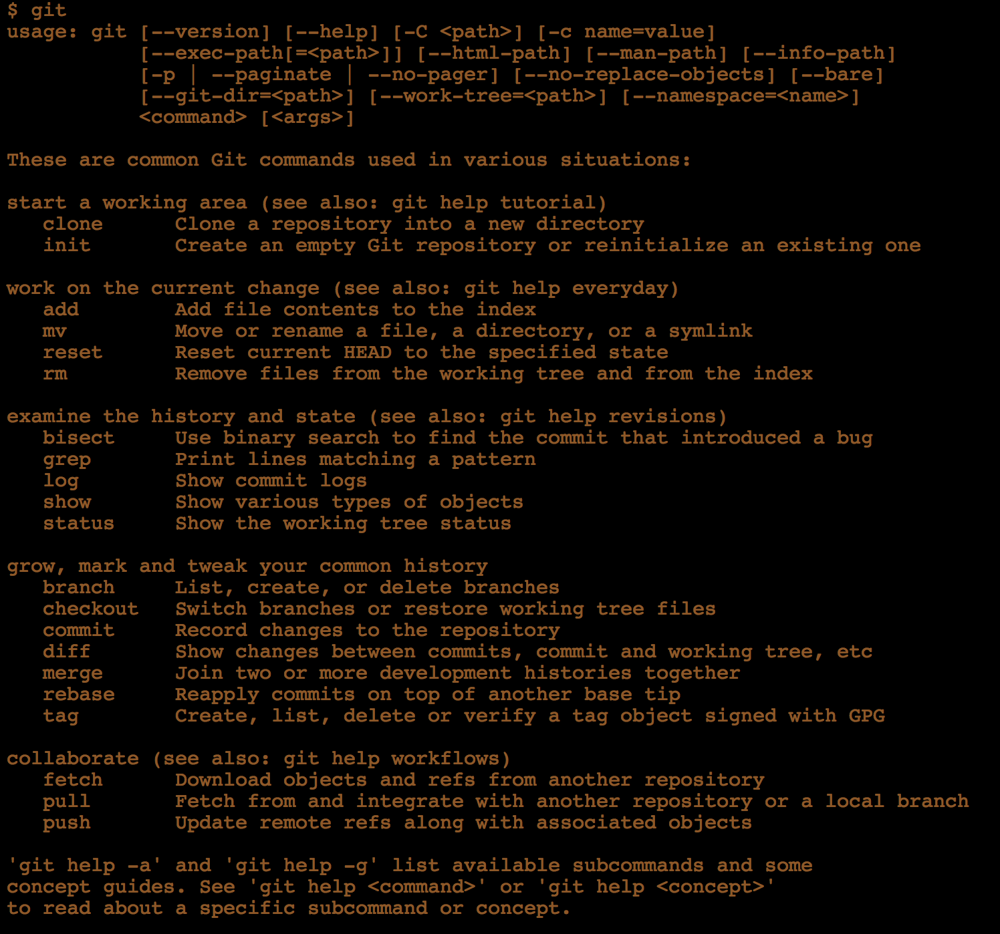

## OBJECTIVE
How about monitoring all your system resources through real-time graphs?.Do you know running too many applications on your system it may start running slow. You want to know what is running on your system - lets start monitoring! :open_mouth:

## PROCEDURE
The tool that you are going to use is netdata. Lets first start it up by installing and then monitoring locally. Later we will tell you where to find resource to know more about it.

**It's really simple!**
- Get started with installing dependencies based on your Operating System:

      # Debian / Ubuntu
      apt-get install zlib1g-dev uuid-dev libmnl-dev gcc make git autoconf autoconf-archive autogen automake pkg-config curl

      # Fedora
      dnf install zlib-devel libuuid-devel libmnl-devel gcc make git autoconf autoconf-archive autogen automake pkgconfig curl

      # CentOS / Red Hat Enterprise Linux
      yum install autoconf automake curl gcc git libmnl-devel libuuid-devel lm_sensors make MySQL-python nc pkgconfig python python-psycopg2 PyYAML zlib-devel

- You need [`git`](https://git-scm.com/) as you next dependency install it from [**HERE**](https://git-scm.com/book/en/v2/Getting-Started-Installing-Git). Open [terminal](https://en.wikipedia.org/wiki/Traceroute) check if git installed properly type `git` :octocat:. You should see something like this :->

### ** Beware don't close your Terminal it's not done yet :stuck_out_tongue_winking_eye:**

- Now clone [`netdata repo`](https://github.com/firehol/netdata) using below commands:

      # download it - the directory 'netdata' will be created
      git clone https://github.com/firehol/netdata.git --depth=1
      cd netdata

      # run script with root privileges to build, install, start netdata
      ./netdata-installer.sh

- It's done now open your browser and type `localhost:19999` [**magic happens here**](localhost:19999/) See something like this

## NOTE

Need to read more about [`netdata tool`](https://github.com/firehol/netdata). In case if you want to do netdata configurations [`** Go Here **`](https://github.com/firehol/netdata/wiki/Installation)
